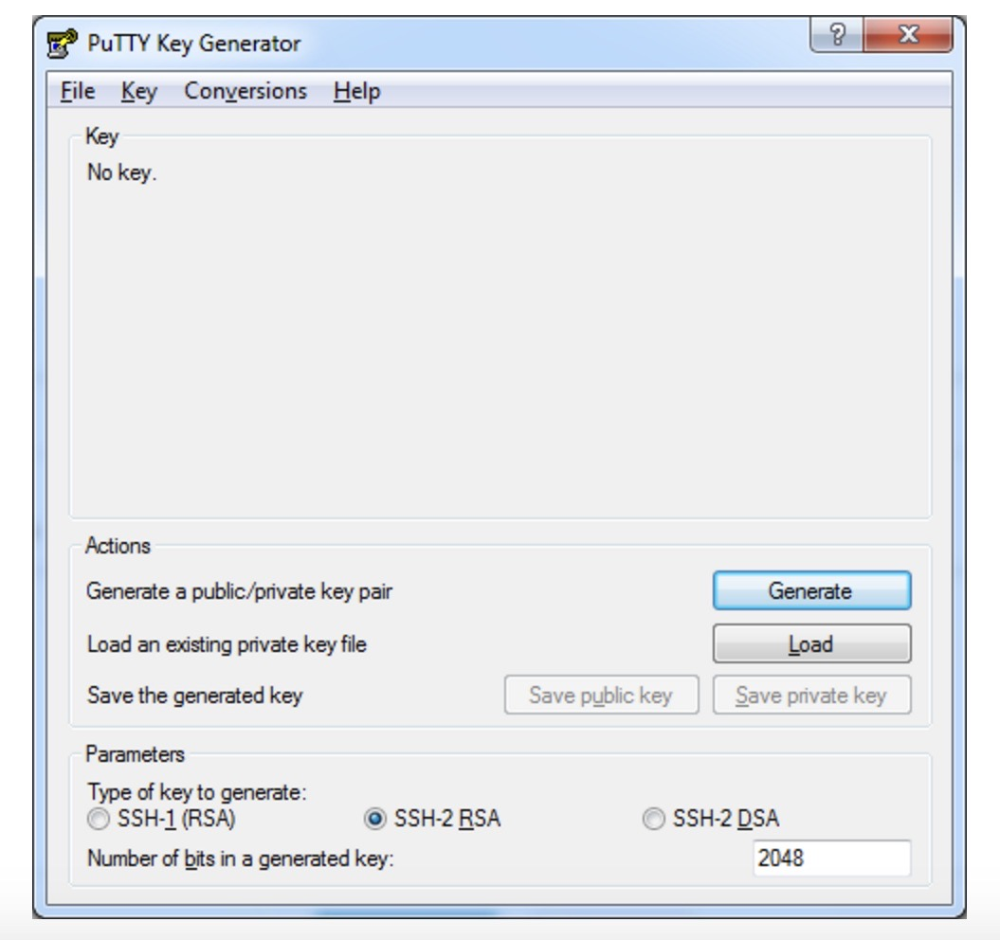
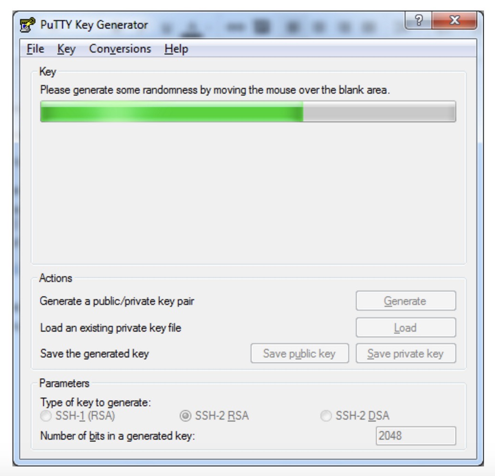

# «Делаем приложение автономным»


## 1. Подготовка проекта для загрузки на сервер
  * Открываем наш проект в **IntelliJ IDEA**
  * Переходим во вкладку **File -> Project Structure**
  * Далее в структуре проекта идем в раздел **Artifacts**
  * Добавляем новый Artifacts, нажимаем **«+» -> JAR -> From modules with dependencies**
  * В разделе **Main Class** нажимаем нажимаем на **«папку»**
  * **IDEA** будет искать класс с методом **main**
  * Изменяем директорию файла, удаляем **/src/main/resources**
  * Нажимаем **ОК**
  * Далее нажимаем **APPLY** и затем **OK**
  * Переходим в **Build -> Build Artifacts**
  * Выбираем наш **проект.jar -> Build**
  * Появится папка **out/artifacts/наш проект_jar/наш проект.jar**
 

  
 
## 2. Генерируем SSH ключ

### SSH-ключ для Linux/MacOS
  * Откройте терминал и выполните команду:
```
ssh-keygen -t rsa
```
  * На консоль будет выведен следующий диалог предлагающий указть путь к папке для хранения вашего **PRIVATE KEY** и **PUBLIC KEY** :
```
Enter file in which to save the key (/home/user/.ssh/id_rsa):
```
  * Нажмите на клавишу **Enter**. Далее система предложит ввести кодовую фразу для дополнительной защиты SSH-подключения. Этот шаг можно пропустить. При ответе на этот и следующий вопрос просто нажмите клавишу **Enter**.
```
Enter passphrase (empty for no passphrase):
```
  * После этого ключ будет создан, а на консоль будет выведено следующее сообщение:
```
Your identification has been saved in /home/user/.ssh/id_rsa.
Your public key has been saved in /home/user/.ssh/id_rsa.pub.
The key fingerprint is:
476:b2:a8:7f:08:b4:c0:af:81:25:7e:21:48:01:0e:98 user@localhost

The key's randomart image is:

+--[ RSA 2048]----+

|+.o.             |

|ooE              |

|oo               |

|o.+..            |

|.+.+..  S .      |

|....+  o +       |

|  .o ....        |

|  .  .. .        |

|    ....         |

+-----------------+
```
  * Далее выполните в терминале команду:
```
cat ~/.ssh/id_rsa.pub
```
  * На консоли отобразится ключ, который впоследствии понадобится для запуска виртуальной машины.

### SSH-ключ для Windows
  * В OC Windows подключение к удаленным серверам по SSH возможно, например, с помощью клиента **Putty**. Скачать его можно [здесь](https://www.chiark.greenend.org.uk/~sgtatham/putty/latest.html) (ссылка взята с [официального сайта](https://putty.org/)). **Putty** не требует установки — чтобы начать с ним работать, достаточно просто распаковать скачанный архив.

По завершении распаковки запустите файл **puttygen.exe**.

Выберите тип ключа **SSH-2 RSA** и длину **2048 бит**, а затем нажмите на кнопку **Generate**:


  
  * Во время генерации водите курсором в пустой области окна (это нужно для создания псевдослучайности):



  * Сохраните сгенерированную пару ключей на локальной машине (кнопки **Save public key** и **Save private key**). Впоследствии **public key** понадобится для запуска виртуальной машины


## 3. Виртуальная машина Yandex Cloud
  * Заходим на сайт [Yandex Cloud](https://cloud.yandex.ru/)
  * Создаем платежный аккаунт и привязываем платежную карту, если аккаунт отсутствует 
  * Выбираем сервис **Сompute Cloud**
  * Переходим в раздел **виртуальные машины** нажимаем **Создать виртуальную машину**
  * Заполняем **Имя**
  * В Разделе **Выбор образа/загрузочного диска** выбираем операционную систему **Ubuntu версии 20.04**
  * В разделе **диски и файловые хранилища** выбираем тип **HDD** и уменьшаем размер до **10 Гб**
  * В разделе **вычислительные ресурсы** выбираем **Своя конфигурация** и выбираем:
``` 
Платформа -Intel Ice Lake, 
vCPU - 2, 
Гарантированная доля vCPU - 20%, 
RAM - 1 Гб, 
Дополнительно - прерываемая (Если поставить галочку Яндекс будет сам останавливать сервис когда захочет, и предется его перезапускать. Необходимо выбрать взависимости от ваших потребностей. Выбор отобразится на цене)
```
  * В разделе **Доступ** убираем галочку с поля **Разрешить** оставляем **Доступ через OS Login**, откроются поля логин и SSH, заполняем логин
  * Сгенерируемый по инструкции SSH ключ копируем в поле **SSH-ключ**
  * Нажимаем **создать ВМ** (Если все верно сделано, то стоимость будет минимальной)
  * Дожидаемся статуса **Running**
  * Переходим в настройки раздел **Сеть** и копируем **Публичный IPv4-адрес** для поиска компьютера в сети


## 4. Запускаем приложение Java Jar в Linux
  * Открываем терминал **своего ПК**
  * Вводим команду **ssh ваш_login, собака @** и скопированный **Публичный IPv4-адрес** в одну строчку:
```
ssh ваш_login@88.159.151.177
```
  * На консоль будет выведен диалог,подтверждаем вводим **yes** и воодим пароль если запросит, который мы задавали при создании SSH-ключей
  * После подключения к удаленному компьютеру в консоли будет отображаться **имя пользователя** и **имя компьютера** которые вы задали при создании виртуальной машины в Yandex Cloud. Тоесть на удаленный компьютер мы установили **Linux** и теперь в терминале мы находимся внутри **Linux** и в терминале будут все команды **Линукса**
  * Проверим версию java набирая команду (команда будет не найдена, но будут подсказки по установке java):
```
java --version
```
  * Набираем команду для установки java на нашу виртуальную машину (либо ту версию, на которой писали проект):
```
sudo apt install openjdk-17-jre-headless
```
  * На вопрос Do you want to continue? [Y/n] нажимаем **enter/return**
  * Дожидаемся установки и затем проверим что все прошло удачно:
```
java --version
```
  * Если Java по-прежнему не установлена, то нужно ввести команду и повторить установку Java сначало:
```
sudo apt-get update
```
  * Открываем наш проект в **IntelliJ IDEA**
  * В папке **out/artifacts/наш проект_jar/наш проект.jar** нажимаем правой кнопкой на **наш проект.jar** файл, кликаем на **Copy Path/Reference** и копируем абсолютный путь к файлу, он нам понадобится, выбираем **Absolute Path**
  * Открываем новое окно терминала **СВОЕГО ПК**
  * Перекидываем файл jar  на виртуальную машину вводим команду **scp, ВАШ ПУТЬ К ФАЙЛУ/НАЗВАНИЕ ФАЙЛА.jar ВАШ_LOGIN, собака** и скопированный **Публичный IPv4-адрес** с **обязательным двоеточием в конце**:
```
 scp /ТУТ ВАШ ПУТЬ К ФАЙЛУ/НАЗВАНИЕ ФАЙЛА.jar ВАШ_LOGIN@ВАШ_IPv4:
```
  * В **терминале ВМ** вводим команду (Смотрим что появился наш файл):
```
ls
``` 
  * Вводим команду в **терминале ВМ** которая создает группу пользователей:
```
sudo groupadd -r appmgr
```
  * Cоздаем конкретного пользователя, относящегося к определенной группе пользователей, мы будем запускать программу от имени этого пользователя:
```
sudo useradd -r -s /bin/false -g appmgr jvmapps
```
  * Проверяем что он создался, вводим комнду:
```
id jvmapps
```
  * Вводим команду pwd (смотрим где мы находимся, в какой директории):
```
pwd
```
  * Следующий шаг нужно создать программу, вводим команду:
```
sudo nano /etc/systemd/system/myapp.service
```
  * Открывается редактор **nano**. Копируем и начинаем редактировать:
```
[Unit]
Description=Manage Java service

[Service]
WorkingDirectory=/opt/prod
ExecStart=/bin/java -Xms128m -Xmx256m -jar myapp.jar
User=jvmapps
Type=simple
Restart=on-failure
RestartSec=10

[Install]
WantedBy=multi-user.target
```
  * Редактируем директорию **WorkingDirectory=/home/ВАШ_LOGIN**
  * Редактируем название файла, который скачали на ВМ ExecStart=/bin/java -Xms128m -Xmx256m -jar НАЗВАНИЕ_ВАШЕГО_ФАЙЛА.jar
  * Итоговый файл будет таким:
```
[Unit]
Description=Manage Java service

[Service]
WorkingDirectory=/home/ВАШ_LOGIN
ExecStart=/bin/java -Xms128m -Xmx256m -jar НАЗВАНИЕ_ВАШЕГО_ФАЙЛА.jar
User=jvmapps
Type=simple
Restart=on-failure
RestartSec=10

[Install]
WantedBy=multi-user.target
```
  * Нажимаем для сохранения **control + O** затем enter/return
  * Для выхода из редактора nano нажимаем **control + X**
  * Пользователю которого создали нужно дать ему права для домашней папки (для рабочей папки нашей программы), вводим:
```
sudo chown -R jvmapps:appmgr /home/НАЗВАНИЕ ВМ
```
  * Вводим команду:
```
sudo systemctl daemon-reload
```
  * Вводим команду:
```
sudo systemctl start myapp.service
```
  * Проверяем статус работы нашей программы, вводим команду:
```
systemctl status myapp
``` 
  * Чтобы тормознуть программу вводим:
```
sudo systemctl stop myapp.service
```
  * Вводим команду для включения автозапуск программы:
```
sudo systemctl enable myapp
```
  * https://computingforgeeks.com/how-to-run-java-jar-application-with-systemd-on-linux/


